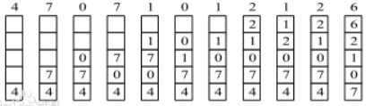

# 146. LRU缓存机制
题目链接：[传送门](https://leetcode-cn.com/problems/lru-cache/)

## 题目描述：
运用你所掌握的数据结构，设计和实现一个`LRU`(最近最少使用) 缓存机制。它应该支持以下操作：获取数据`get`和写入数据`put`。

- 获取数据`get(key)`：如果密钥`(key)`存在于缓存中，则获取密钥的值（总是正数），否则返回`-1`。
- 写入数据`put(key, value)`：如果密钥已经存在，则变更其数据值；如果密钥不存在，则插入该组「密钥/数据值」。当缓存容量达到上限时，它应该在写入新数据之前删除最久未使用的数据值，从而为新的数据值留出空间。

**进阶**：你是否可以在 $O(1)$ 时间复杂度内完成这两种操作？

## 解决方案：
- 时间复杂度：$O(1)$
- 空间复杂度：$O(n)$
- 思路：哈希表+双向链表。使用一个双向链表来维护时间先后的节点，即双向链表从头节点到尾节点的时间顺序为从新到旧。另外用一个哈希表来映射key对应双向链表中的每个节点，这样操作的时间复杂度就大大降低了。
- 概念：`LRU`（`Least Recently Used`）即最近最少使用，是一种常用的页面置换算法，选择最近最久未使用的页面予以淘汰。该算法赋予每个页面一个访问字段，用来记录一个页面自上次被访问以来所经历的时间`t`，当须淘汰一个页面时，选择现有页面中其`t`值最大的，即最近最少使用的页面予以淘汰。



## AC代码：
```java
class LRUCache {
	// 双向链表存放的节点
	private Map<Integer, LRUCacheNode> map;
	// 一个双向链表
	private LRUCacheDoubleLinkList dbLinkList;
	// size 为实际存储元素的个数
	private int capacity, size;
	public LRUCache(int capacity) {
		map = new HashMap<Integer, LRUCacheNode>();
		dbLinkList = new LRUCacheDoubleLinkList();
		this.capacity = capacity;
		this.size = 0;
	}
	public int get(int key) {
		if (map.containsKey(key)) {
			LRUCacheNode cur = map.get(key);
			// 更新该节点到头节点
			updateNode(cur);
			return cur.value;
		}
		return -1;
	}
	public void put(int key, int value) {
		if (map.containsKey(key)) {
			LRUCacheNode cur = map.get(key);
			// 新值覆盖旧值
			cur.value = value;
			// 更新该节点到头节点
			updateNode(cur);
			return;
		}
		LRUCacheNode newNode = new LRUCacheNode(key, value);
		map.put(key, newNode);
		dbLinkList.addFirst(newNode);
		if (this.size == this.capacity) {
			LRUCacheNode lastNode = dbLinkList.removeLast();
			// 记得删除哈希表中的key
			map.remove(lastNode.key);
		} else
			this.size++;
	}
	// 把该节点删除，并添加到双向链表的头节点
	private void updateNode(LRUCacheNode target) {
		dbLinkList.remove(target);
		dbLinkList.addFirst(target);
	}
}
// 构造双向链表中的节点类
class LRUCacheNode {
	int key, value;
	LRUCacheNode prev, next;
	public LRUCacheNode(int key, int value) {
		this.key = key;
		this.value = value;
		this.prev = this.next = null;
	}
}
// 构造一个双向链表的类
class LRUCacheDoubleLinkList {
	// 虚拟固定一个头指针和尾指针，便于操作
	private LRUCacheNode dummyHead;
	private LRUCacheNode dummyTail;
	public LRUCacheDoubleLinkList() {
		this.dummyHead = new LRUCacheNode(-1, -1);
		this.dummyTail = new LRUCacheNode(-2, -2);
		this.dummyHead.next = this.dummyTail;
		this.dummyTail.prev = this.dummyHead;
	}
	public void addFirst(LRUCacheNode target) {
		// head -> target -> nextNode
		LRUCacheNode nextNode = dummyHead.next;
		target.prev = dummyHead;
		target.next = nextNode;
		dummyHead.next = target;
		nextNode.prev = target;
	}
	public LRUCacheNode removeLast() {
		return this.remove(dummyTail.prev);
	}
	public LRUCacheNode remove(LRUCacheNode target) {
		if (this.isEmpty())
			return null;
		// prevNode -> target -> nextNode
		LRUCacheNode prevNode = target.prev, nextNode = target.next;
		prevNode.next = nextNode;
		nextNode.prev = prevNode;
		target.prev = target.next = null;
		return target;
	}
	public boolean isEmpty() {
		return this.dummyHead.next == this.dummyTail;
	}
}
```