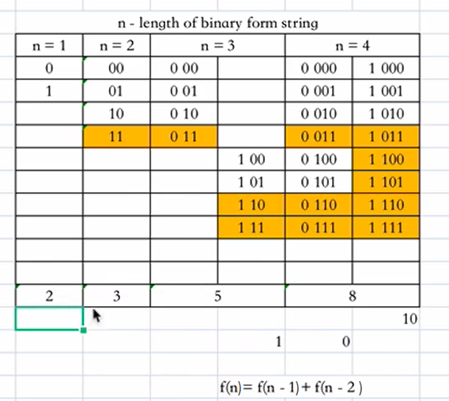

# 600.不含连续1的非负整数
题目链接：[传送门](https://leetcode-cn.com/problems/non-negative-integers-without-consecutive-ones/)

## 题目描述：
给定一个正整数`n`，找出小于或等于`n`的非负整数中，其二进制表示不包含**连续的1**的个数。

**说明**：$1 \leq n \leq 10^9$

**示例**:
- 输入: 5
- 输出: 5
- 解释:

``` 
下面是带有相应二进制表示的非负整数<= 5：
0 : 0
1 : 1
2 : 10
3 : 11
4 : 100
5 : 101
其中，只有整数3违反规则（有两个连续的1），其他5个满足规则。
```

## 解决方案：
- 时间复杂度：$O(n)$
- 空间复杂度：$O(n)$
- 思路：找规律。定义`f(i)`表示长度为`i`时不含有连续1的二进制数的个数，通过找规律可以发现结论：`f(i)=f(i-1)+f(i-2)`。对于给定数字n，我们只需从其二进制数的高位往低位只遍历`1`的情况，即找比n更小的数字并统计其二进制中1的个数，个数为`dp[len(str)-i-1]`。若出现连续1的情况，则直接返回res，否则返回res+1。



## AC代码：
```go
func findIntegers(n int) int {
	dp := make([]int, 32)
	dp[0] = 1
	dp[1] = 2
	for i := 2; i < 32; i++ {
		dp[i] = dp[i-1] + dp[i-2]
	}
	numStr, res := getBinary(n), 0
	for k, v := range numStr {
		if v == '0' {
			continue
		}
		res += dp[len(numStr)-k-1]
		if k != 0 && numStr[k-1] == '1' { //若出现连续1，非法直接返回，注意：当前位的1实际会变成0，所以当前累加的也是合法数
			return res
		}
	}
	return res + 1 //说明没有出现连续的1，那么要加上 n 本身这个数
}
func getBinary(n int) string {
	str := ""
	for ; n > 0; n >>= 1 {
		if n&1 == 0 {
			str = "0" + str // 注意是首位添加余数
		} else {
			str = "1" + str
		}
	}
	return str
}
```